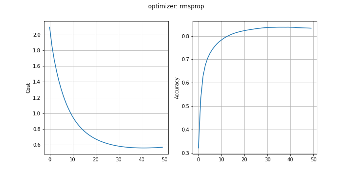
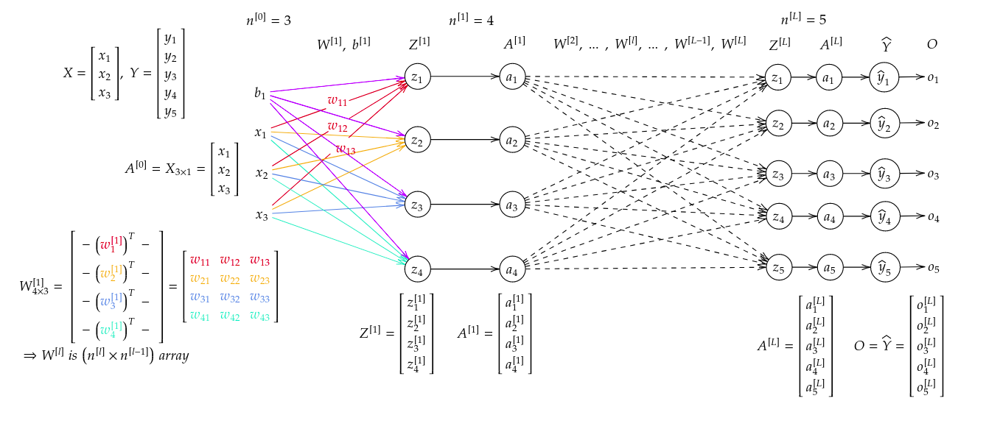

# classification-neural-network
Implementing a simple neural network in Python for classification.  

Load data from `pickle file` or keras.  

- Initializers:
	* Random
	* Xavier
	* He
	
- Optimizers:
	+ GD with momentum
	+ Adam
	+ RMSprop

- Loss functions:
	+ Binary cross-entropy
	+ Categorical cross-entropy

## Requirement
- IPython
- matplotlib
- numpy

---
---

Final result (optimizer: RMSprop)  

**Notation**

