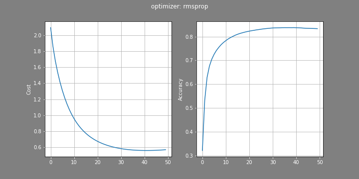

# classification-neural-network
Implementing and training a simple neural network in Python for handwritten digits classification using MNIST dataset (you can also use it for binary classification problems).  

In binary classification, use sigmoid activation function for output layer and binary cross-entropy for loss.  
In multi-class classification, use softmax activation function for output layer and categorical cross-entropy for loss.  

The MNIST database (Modified National Institute of Standards and Technology database) of handwritten digits consists of a training set of 60,000 examples and a test set of 10,000 examples.
The black and white images from 'NIST' were size-normalized and centered to fit into a 28x28 pixel bounding box.  

The input layer has 784 neurons. The output layer has 10 neurons, which represents the probability that the image is the digit 0-9.

Load MNIST dataset from `./data/mnist.pkl` or keras.  

- Initializers:
	* Random
	* Xavier
	* He
	
- Optimizers:
	+ GD with momentum
	+ Adam
	+ RMSprop

- Loss functions:
	+ Binary cross-entropy
	+ Categorical cross-entropy

## Requirement
- IPython
- matplotlib
- numpy

---
---

Final result (MNIST dataset and RMSprop optimizer)  

**Notation**

